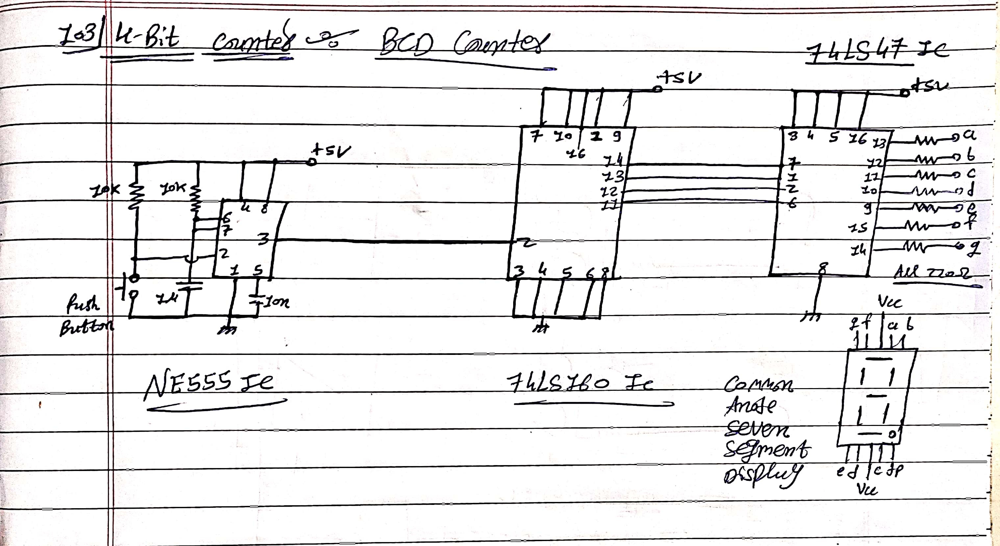

# 🔢 4-Bit-Synchronous-BCD-Counter

This project demonstrates a **4-Bit Synchronous BCD Counter** built using the **NE555 Timer**, **74LS160 Counter**, and **74LS47 BCD to 7-Segment Decoder** ICs.  
The circuit counts from `0` to `9` and displays the output on a **common anode 7-segment display**.

---

---

## 🧩 Components Required

| Component | Description | Quantity |
|------------|--------------|-----------|
| NE555 Timer IC | Clock pulse generator | 1 |
| 74LS160 IC | 4-bit synchronous BCD counter | 1 |
| 74LS47 IC | BCD to 7-segment decoder/driver | 1 |
| 7-Segment Display (Common Anode) | Numeric output display | 1 |
| Push Button | Manual trigger for NE555 | 1 |
| Resistors | 10kΩ × 2, 220Ω × 7 (for display segments) | 9 |
| Capacitors | 10nF × 1, 10µF × 1 | 2 |
| Power Supply | +5V DC | 1 |

---

## ⚙️ Circuit Description

### 1. **Clock Generator (NE555 IC)**
The **NE555 timer** is configured in **astable mode** to generate a continuous stream of square wave pulses.  
These pulses act as the **clock input** for the 74LS160 counter.

- **Key Connections:**
  - Pins 2 & 6 connected together.
  - Pin 3 provides the output clock pulse.
  - Resistors (10kΩ) and capacitors (10nF, 10µF) determine the frequency.
  - A **push button** allows manual triggering for demonstration.

---

### 2. **4-Bit Synchronous Counter (74LS160)**
The **74LS160** is a synchronous 4-bit BCD counter.  
It counts binary-coded decimal values from `0000` (0) to `1001` (9) and then resets automatically to `0000`.

- **Features:**
  - Synchronous counting (all flip-flops clocked simultaneously)
  - Clear and load functions for initialization
  - BCD limit (resets after 9)

- **Key Pins:**
  - **Clock Input (Pin 2):** From NE555 output
  - **Clear & Load (Pins 1, 9):** Active-low control (tied appropriately for continuous counting)
  - **Outputs (QA–QD):** Connected to 74LS47 inputs
  - **VCC (Pin 16):** +5V
  - **GND (Pin 8):** Ground

---

### 3. **BCD to 7-Segment Decoder (74LS47)**
The **74LS47** IC decodes the 4-bit BCD output from the counter and drives a **common anode 7-segment display**.

- **Operation:**
  - Takes binary inputs (A, B, C, D) and lights up the appropriate LED segments (`a–g`).
  - Segment outputs are **active low**, so current-limiting resistors (220Ω) are connected to each segment.

- **Connections:**
  - Inputs: From QA–QD outputs of 74LS160
  - Outputs: Connected to segments a–g via resistors
  - Common anode connected to +5V

---

## 🔌 Power Supply

- The circuit operates on a **regulated +5V DC** power supply.  
- Ensure a clean and stable supply to prevent counting errors.

---

## 🖥️ Output

- The 7-segment display visually represents the **decimal count (0–9)**.  
- Each clock pulse increments the count by 1.  
- After displaying `9`, the counter resets automatically to `0`.

---

## 🧠 Learning Objectives

Through this project, you will learn:

- How to configure the **NE555 Timer in astable mode**  
- The working of a **synchronous BCD counter (74LS160)**  
- How to **decode BCD to 7-segment display** using the 74LS47  
- The principle of **synchronous digital counting circuits**

---

## 🧰 Applications

- Digital clocks  
- Event counters  
- Frequency measurement systems  
- Educational demonstration kits for digital electronics  

---

## 🖼️ Circuit Diagram

> Hand-drawn schematic of the **4-Bit Synchronous BCD Counter**:

---

## ⚡ Future Improvements

- Replace NE555 with a **crystal oscillator** for higher precision.  
- Cascade multiple 74LS160 ICs to count up to 99 or higher.  
- Use a **common cathode display** with suitable decoder ICs (like 74LS48).

---

## 👨‍💻 Author

**Project by:** [Your Name]  
**GitHub Repository:** [Your Repository Link]  
**Date:** November 2025  

---

## 📄 License

This project is licensed under the [MIT License](LICENSE).

---

⭐ *If you find this project helpful, consider giving it a star on GitHub!*
